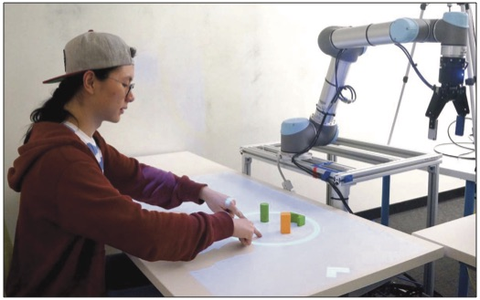
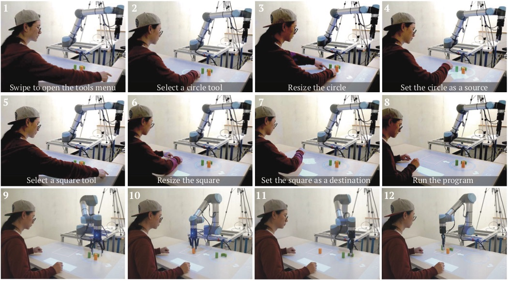
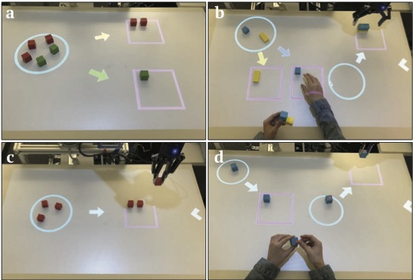

<figure class="center">
  
  <figcaption><i>PATI allows users to use common gestures and tools to teach their robots new tasks with direct reference to and interactions with the environment in an augmented, situated manner.</i></figcaption>
</figure>

# Abstract
As robots begin to enter human environments to provide individuals with daily assistance, their end users, who do not have technical training or backgrounds in robotics or programming, will ultimately need to program and “re-task” their robots to perform a variety of custom tasks. In this work, we present PATI—a Projection-based Augmented Table-top Interface for robot programming—through which users are able to use simple, common gestures (e.g., pinch gestures) and tools (e.g., shape tools) to specify table-top manipulation tasks (such as pick-and-place) for a robot manipulator. PATI allows users to interact with the environment directly when providing task specifications. For example, users can use gestures and tools to annotate the environment with task-relevant information, such as specifying target landmarks and selecting objects of interest. We conducted a user study to compare PATI with a state-of-the-art, standard industrial method for end-user robot programming. Our results show that participants needed significantly less training time before they felt confident in using our system than they did for the industrial method. Moreover, the participants were able to program a robot manipulator to complete a pick-and-place task significantly faster with PATI. This work indicates a new direction for end-user robot programming.

<figure class="center">
  
  <figcaption><i>An example procedure of a user programming the robot to perform a pick-and-place task using PATI. (1)–(8) show the process of task specification, and (9)–(12) show the robot performing the programmed task.</i></figcaption>
</figure>
<figure class="center">
  
  <figcaption><i>Possible applications of PATI include (a) sorting, (b) assembly, (c) alignment, and (d) inspection. The colored arrows in (a) and (b) represent how objects would be sorted based on the color attributes.</i></figcaption>
</figure>
